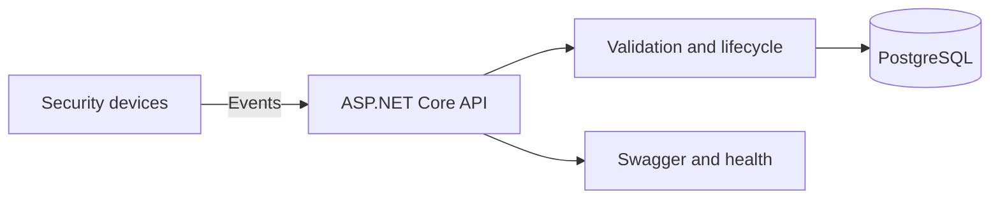

# Security Event Management API

[](https://github.com/Monil1702/Security-Event-Management-API/actions/workflows/ci.yml)
[](https://dotnet.microsoft.com/)
[](https://www.postgresql.org/)

A production-oriented ASP.NET Core API for ingesting, investigating, and resolving events from access controllers, IP cameras, and other physical-security devices.

The project demonstrates C# backend development beyond basic CRUD: asynchronous request handling, explicit event lifecycle rules, duplicate-event protection, indexed filtering, standardized error responses, containerized PostgreSQL, automated tests, and continuous integration.

## Architecture



## Engineering highlights

- C# 12 and ASP.NET Core 8 controller-based REST APIs
- Entity Framework Core with PostgreSQL and explicit schema configuration
- Event lifecycle enforcement: `Open -> Acknowledged -> Resolved`
- SHA-256 fingerprints and a unique database index for idempotent ingestion
- Filtering by status, severity, type, device, and time range with pagination
- Summary metrics for operational dashboards
- `ProblemDetails` error responses and request correlation IDs
- xUnit service tests using isolated in-memory databases
- Multi-stage, non-root Docker image and Docker Compose environment
- GitHub Actions quality gate for formatting, builds, tests, coverage, and Compose validation

## Technology stack

| Area | Technology |
| --- | --- |
| Language and framework | C# 12, .NET 8, ASP.NET Core Web API |
| Persistence | Entity Framework Core, PostgreSQL 16 |
| API documentation | OpenAPI, Swagger UI |
| Testing | xUnit, EF Core InMemory, Coverlet |
| Delivery | Docker, Docker Compose, GitHub Actions |

## Domain model

A `SecurityDevice` represents an access controller, IP camera, or related endpoint. A `SecurityEvent` records what happened, where it originated, its severity, operational status, and resolution history.

Supported event types include:

- Access denied
- Forced door
- Motion detected
- Camera offline
- License plate match
- Device tampering
- Authentication failure

## Run with Docker

Requirements: Docker with Docker Compose.

```bash
cp .env.example .env
# Replace the example password in .env.
docker compose up --build
```

Open Swagger UI at <http://localhost:8080/swagger> and the health endpoint at <http://localhost:8080/health>.

Stop the services without deleting stored data:

```bash
docker compose down
```

To intentionally reset the local database:

```bash
docker compose down --volumes
```

## Run with the .NET SDK

Requirements: .NET 8 SDK and PostgreSQL 16.

```bash
dotnet restore SecurityEventManagement.sln
dotnet run --project src/SecurityEventManagement.Api
```

Override the database connection without editing committed configuration:

```bash
ConnectionStrings__SecurityDatabase='Host=localhost;Port=5432;Database=security_events;Username=postgres;Password=your-password' \
dotnet run --project src/SecurityEventManagement.Api
```

## API endpoints

| Method | Endpoint | Purpose |
| --- | --- | --- |
| `GET` | `/health` | Check API availability |
| `GET` | `/api/v1/devices` | List registered devices |
| `POST` | `/api/v1/devices` | Register a security device |
| `GET` | `/api/v1/devices/{id}` | Retrieve one device |
| `PATCH` | `/api/v1/devices/{id}/status` | Update device connectivity |
| `POST` | `/api/v1/security-events` | Ingest a security event |
| `GET` | `/api/v1/security-events` | Filter and paginate events |
| `GET` | `/api/v1/security-events/{id}` | Retrieve one event |
| `POST` | `/api/v1/security-events/{id}/acknowledge` | Assign event investigation |
| `POST` | `/api/v1/security-events/{id}/resolve` | Resolve an acknowledged event |
| `GET` | `/api/v1/security-events/summary` | Retrieve operational counts |

Example event request:

```json
{
  "deviceId": "replace-with-a-device-guid",
  "eventType": "AccessDenied",
  "severity": "High",
  "description": "Repeated access denial detected at the main entrance.",
  "source": "access-controller",
  "occurredAt": "2026-09-15T12:00:00Z"
}
```

See [`SecurityEventManagement.Api.http`](SecurityEventManagement.Api.http) for a complete request sequence.

## Test

```bash
dotnet test SecurityEventManagement.sln --collect:"XPlat Code Coverage"
```

The tests verify event creation, duplicate rejection, filtering, valid lifecycle transitions, invalid transition handling, and device status updates.

## Repository structure

```text
src/SecurityEventManagement.Api/
  Controllers/       HTTP endpoints
  Data/              EF Core context and demo seed data
  Domain/            Device, event, and lifecycle types
  DTOs/              Validated request and response contracts
  Exceptions/        Domain-aware API exceptions
  Middleware/        Error handling and correlation IDs
  Services/          Asynchronous business logic
tests/
  SecurityEventManagement.Api.Tests/
.github/workflows/   Continuous integration
```

## Design decisions

**Why enforce lifecycle transitions?** Security events represent operational work, not editable notes. Requiring acknowledgement before resolution preserves accountability and prevents incomplete investigations from being silently closed.

**Why generate a fingerprint?** Devices may retry delivery after a timeout. A deterministic fingerprint plus a unique index stops the same event from being stored twice, including under concurrent ingestion.

**Why keep controllers thin?** HTTP concerns stay in controllers while state rules and persistence orchestration remain testable in services.

**What would come next in production?** OAuth 2.0/OIDC authentication, role-based authorization, EF Core migrations, database-backed health checks, message-broker ingestion, OpenTelemetry, rate limiting, and audit-log retention policies.

## Suggested resume bullets

- Built an asynchronous security-event API using C#, ASP.NET Core, EF Core, PostgreSQL, and Docker, supporting device registration, event ingestion, filtering, and operational lifecycle management.
- Implemented idempotent ingestion, indexed queries, state-transition validation, ProblemDetails responses, correlation IDs, xUnit tests, and GitHub Actions CI.

## License

MIT - see [LICENSE](LICENSE).
